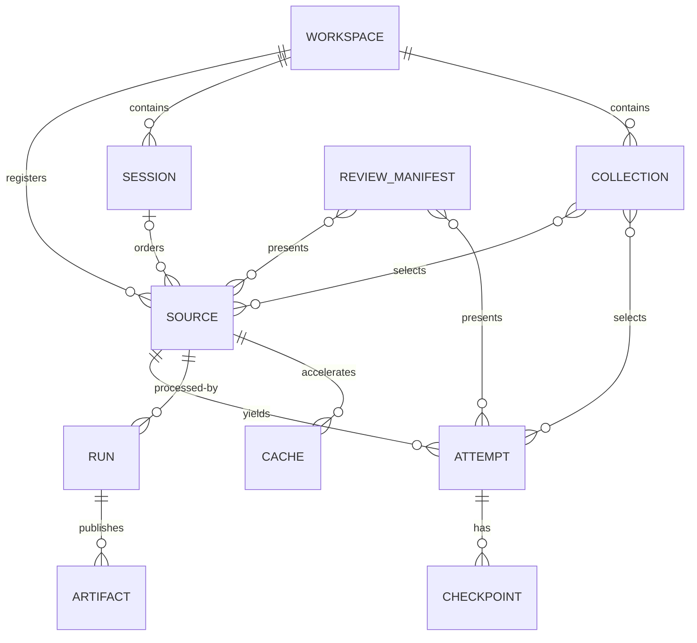

# Domain model

> **Status:** Current · **State:** Maintained · **Work:** None · **As of:** 2026-09-14

This document defines the current organizational model used by the delivery-stage-2 workflow. See the normative [glossary](../reference/glossary.md) for terminology. Current schemas remain documented by their implemented compatibility names until separately versioned migrations are accepted.

## Relationships

## Entities

### Workspace

The application-managed root containing registered source metadata, reusable caches, runs, sessions, collections, and review artifacts. The workspace does not imply that source media is copied into it.

### Source

An immutable media identity established by content fingerprint. A source records one or more known filesystem locations plus probed media metadata. Computation and cache reuse attach to source identity rather than session or collection membership.

### Attempt

A source-time range with stable identity and classification. The proposed classifications are `accepted`, `uncertain`, `rejected`, and `incomplete`. Current `attempts.json` and `shadows.json` remain compatibility artifacts until an attempt-schema migration is designed.

### Session

An optional ordered set of sources plus recording context such as date, event, drill, or notes. A source belongs to zero or one session because a particular media asset has one recording context. Session membership organizes material but does not own or duplicate source computation. Collections provide non-exclusive, thematic, corpus, and cross-session grouping.

### Collection

A named or temporary, non-exclusive selection of sources and/or attempts. A collection may span sessions and may be defined explicitly or by metadata filters. Professional-player corpora and stage-comparison sets are collections.

### Run

A provenance record for one processing execution. It identifies source inputs, configuration, software/model versions, cache decisions, timing, status, errors, and published artifacts. Runs are never used as user recording groups.

### Cache

Reusable, identity-bound intermediate computation. Cache lifecycle is independent of session and collection lifecycle. Deleting a cache may require recomputation but must not delete a source, session, collection, or authoritative annotation.

### Checkpoint and keyframe

A checkpoint is analyzer data for one serve stage. A keyframe is an optional rendered source frame visualizing that checkpoint. Removing a keyframe does not remove or invalidate its checkpoint.

### Review manifest

A versioned presentation contract selecting sources, attempts, checkpoints, media, and keyframes for one review page. A review manifest may represent a source, session, collection, or temporary query without changing membership or recomputing analysis.

## Identity and ownership rules

- Source fingerprint is the unit of media identity and reusable computation.
- Filesystem paths are locators and may change without changing source identity.
- A source belongs to zero or one session; sessions reference sources and do not contain copied media.
- Collections may reference sources from any session or standalone sources.
- Attempts belong to exactly one source and use source PTS ranges.
- Checkpoints belong to exactly one attempt and stage.
- Runs own provenance for generated artifacts, not source media or user annotations.
- Collections are non-exclusive and do not duplicate attempts or analysis.
- Review manifests are projections over existing entities, not another storage owner.

## Supported scopes

The same processing and review system should support:

1. one attempt or explicit source range;
2. one standalone source;
3. one recording session;
4. an ad hoc multi-source selection; and
5. a saved collection spanning sessions.

A standalone source does not require a synthetic one-source session. The review application may still use the same manifest and components for every scope.

## Deferred domain decisions

These decisions do not block the delivery-stage-2 compatibility workflow:

- Attempt reconciliation when detector boundaries change.
- Source metadata versus attempt-level metadata for multi-player footage.
- Source relocation and missing-source recovery.
- Query-backed collection persistence beyond explicit saved collections.
- Run retention and destructive artifact garbage collection.
- Migration from `attempts.json` plus `shadows.json` to classified attempts.
