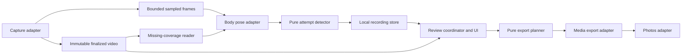

# Serve Review design

Status: proposed implementation specification, 2026-09-04. No app code exists yet.

## 1. Product contract

The user has an iPhone 15 or newer and a tripod. The immediate problem is the time spent locating useful serve footage, not a lack of technical advice. The application must provide value during practice without asking the user to describe their practice format.

### MVP1

Record continuously, identify attempt time ranges, review those attempts, and export an ordered video with dead time removed. Detection happens on device. Review begins after the user stops recording; live replay and audio feedback are out of scope.

An attempt is an observable serve-like swing, including abbreviated and back-of-strings motions. It does not have to contain a conventional toss, full takeback, leg drive, jump, or successful ball strike. Isolated tosses without a swing are excluded by default. Ambiguous shadow motions can be surfaced and excluded manually. These are detection semantics, not a prescribed practice protocol.

The detector identifies the beginning and end of the visible action with padding. These are timestamps, not video-codec keyframes. Playback and export must not snap edits to codec keyframes if that removes useful motion.

### MVP2

Add timestamped phase markers and visual wrist/hand and racket tracks. The user can navigate to a phase, loop its surrounding movement, and inspect optional overlays. This is observational assistance, not automated biomechanical diagnosis.

### Excluded from both releases

Practice protocols, pass/fail scoring, habit-erasure claims, automatic progression, voice predictions, corrective audio, serve-speed estimation, cloud accounts, coaching generation, and multi-camera reconstruction. There is no dependency on an LLM at runtime.

## 2. User flow and defaults

### Capture

- A simple recordings list leads to a camera screen with Record/Stop and a 120/60 fps choice. Default to 1080p/120 fps on supported hardware; report the actual supported selection and fall back visibly to 60 fps before recording if necessary.
- Use the rear wide camera at 1x, with framing guidance for one player and the full racket arc. Lock capture orientation when recording begins. Do not require court calibration or a full-court view.
- MVP1 records silent video. No microphone permission is needed; neither detection nor export depends on impact audio.
- Keep the foreground app awake while recording. Backgrounding or a capture interruption stops/finalizes the recording where possible and reports the interruption. Background capture is not promised.

### Review

- After Stop, finalize the file and outstanding analysis. Show progress if work remains. Do not show a finished attempt count until detection is complete.
- Display the first included attempt, its index/count, previous/next controls, and a scrubber bounded to that attempt. Playback stops at the attempt end; looping is an explicit toggle. Offer 1x, 0.5x, and 0.25x playback plus previous/next source-frame controls.
- Pinch-to-zoom changes review presentation only. It does not change exported framing.
- Boundary editing reveals adjacent source footage. Allow adjusting, adding, excluding/restoring, and splitting ranges. Split creates two nonoverlapping ranges at a chosen interior timestamp. Manual recovery may use the full-source timeline; normal review does not require it.
- Empty detection results explain that nothing was found and offer manual recovery. Never substitute the entire recording as a fake detected attempt.
- Local recordings remain available after relaunch. Explicit deletion removes the source and derived local files; it does not delete an already exported Photos asset.

### Export

- Save one silent video of all included effective ranges in source order, with no titles, transitions, overlays, or gaps. Normal playback speed is independent of the review speed setting.
- Preserve source dimensions, display orientation, and timing/frame cadence where encoding permits. Validate the 120 fps export path before release. If only a lower rate is supported, disclose it before export; do not silently downsample or stretch playback duration.
- Use add-only Photos authorization at export time. Permission denial, cancellation, and export failures preserve the source and edits and allow retry. Prevent duplicate submissions while an export is active; repeated intentional exports may create separate assets.
- Snapshot the edit revision when export starts. Disable editing for that export or export the snapshot consistently; never combine revisions.
- Overlapping included ranges are unioned by the export planner to avoid repeating the same source frames. Review ranges remain editable independently. Ignore excluded ranges and reject empty exports.

## 3. Architecture for bounded implementation

Prefer a few enforceable modules to a framework. Use Swift 6 language mode with strict concurrency checking, iOS 18+, and a Swift package whose pure targets can run on macOS. Use standard Apple frameworks; no third-party computer-vision runtime in MVP1.

### Planned layout and ownership

| Area | Responsibility | Forbidden dependencies/behavior |
| --- | --- | --- |
| `Packages/ServeCore/Sources/Domain` | Value types, timestamps, edits, validation, schemas | No AVFoundation, Vision, UIKit, SwiftUI, file I/O, or global state. |
| `Packages/ServeCore/Sources/Detection` | Pose-sequence-to-attempt logic, metrics | Domain only; no capture or UI code. |
| `Packages/ServeCore/Sources/Editing` | Effective ranges and export plan | Domain only; never encode or mutate media. |
| `App/Adapters` | Capture, frame reading, Vision, persistence, playback, export, Photos | Each adapter implements one contract; adapters do not call UI. |
| `App/Features` | Recordings, capture, review, export views and coordinators | Depend on injected contracts; no detector rules or direct persistence writes in views. |
| `Tools/Evaluation` | macOS fixture reader, pose extraction, evaluation reports | Share detector and metrics with app; no second detector implementation. |
| `Tests/Fixtures` | Small synthetic inputs and expected behavior | No private recordings or opaque huge fixtures. |

MVP2 adds `Packages/ServeCore/Sources/Analysis` and corresponding adapters. Avoid empty plugin frameworks, generic event buses, dependency-injection libraries, or separate repositories. A composition root constructs concrete services; tests inject fakes. UI state is main-actor isolated; adapters serialize their own mutable resources. Do not silence concurrency failures with broad unchecked-sendable annotations.

### Contracts frozen before parallel implementation

Names below are proposed public contracts, not existing APIs. M1 converts them to compiling Swift signatures and fixtures; subsequent workers consume those definitions.

| Contract | Input → output and invariant |
| --- | --- |
| `CaptureService` | Configuration → recording handle; stop → finalized asset metadata or explicit partial/failure result. No attempt detection inside it. |
| `FrameSource` | Asset plus source range and sampling policy → timestamped frames. Live and offline adapters use the same source-relative time convention. |
| `BodyPoseEstimator` | Frame → zero or more pose observations with confidence and visibility. No fabricated joints for missing observations. |
| `AttemptDetector` | Ordered timestamped pose observations plus configuration → candidate ranges. Reset/finish are explicit; no internal wall clock or I/O. |
| `RecordingStore` | Validated document revisions and asset references → atomic local persistence. Stale saves fail rather than overwriting newer edits. |
| `ReviewSession` | Recording plus edits → selection, effective ranges, and navigation state. No video decoding. |
| `ExportPlanner` | Effective ranges and source metadata → normalized ordered export ranges and expected duration. Pure and deterministic. |
| `VideoExporter` | Immutable export plan → local completed movie or error/cancellation. No Photos access. |
| `PhotoLibraryWriter` | Completed movie URL → saved-asset receipt or explicit error. No trimming or encoding. |

Frame payloads are adapter-owned; pixel buffers and framework objects never enter the portable domain module. The frame-source protocol that carries those objects lives in the platform adapter layer. Portable domain contracts only carry metadata, observations, and ranges.

## 4. Data, coordinates, and lifecycle

### Minimal persistent data

- `Recording`: UUID, schema version, creation time, relative source path, asset duration/dimensions/frame-rate metadata, display transform, lifecycle status, edit revision.
- `MediaTime`: integer value and positive timescale. Source time zero is the first recorded video sample; use rational comparisons, not frame-number/fps arithmetic or wall-clock timestamps.
- `Attempt`: UUID, recording ID, detected range, detector version/configuration ID, and optional boundary override; included/excluded status. Effective range is override if present, otherwise detected range.
- `AnalysisRun`: versioned method/configuration, completion status, source fingerprint, and derived-file references. MVP1 uses this for resumable coverage and pose caching, not a user dashboard.
- `ExportReceipt`: source/edit revision, export status, and optional Photos asset identifier. It does not transfer ownership of the original source.

Ranges are half-open `[start, end)`, inside the source duration, with start less than end. A candidate must contain at least one source sample after normalization. IDs persist across review/export and are not array indices. Re-analysis produces a new candidate set for explicit adoption; it never silently replaces manually edited attempts. MVP1 offers no ordinary re-analysis UI beyond incomplete-job recovery.

Use per-recording directories under Application Support, immutable finalized `.mov` sources, atomic JSON document writes, and versioned derived sidecars. No database is needed initially. Newer unsupported schema versions fail read-only with an actionable message; do not reset or delete them. MVP2 adds optional annotation sidecars keyed by recording/attempt IDs and source times, leaving MVP1 sources and edits readable.

Normalize observations to the upright, unmirrored display image, origin top-left, coordinates in `[0,1]`. Record the transform from encoded pixels. All preview zoom, letterboxing, rotation, and future region-of-interest transforms map through this convention. Test portrait and landscape explicitly. A 2D wrist coordinate is not a wrist angle.

### Capture and processing

Use `AVCaptureVideoDataOutput` with `AVAssetWriter` for explicit presentation-timestamp ownership. Send samples to the writer on a serialized media queue. Analysis receives only bounded, sampled references and must never block the writer. Start body-pose inference at a configurable 15 samples/second; full-resolution source samples remain available for review and later analysis. Keep at most one in-flight and one pending analysis frame; replace stale pending analysis work when overloaded.

Normalize live timestamps against the writer's first sample. Verify live and decoded-file timestamps agree in the media adapter milestone. A failed writer append or capture frame drop is recorded as a capture-quality event, not disguised as an analysis skip. Stop safely on unrecoverable writing errors.

Track missing intervals relative to the intended analysis sample schedule. After finalization, fill missing coverage from the source file, then run the deterministic detector over the ordered observation sequence. Do not merge overlapping partial detector results ad hoc. A completed cache avoids redundant inference, but final candidate generation must use a coherent sequence.

A force-quit may leave an unfinalized movie unreadable. Mark it incomplete, attempt to open finalized media on next launch, and report unrecoverable footage honestly. Never claim crash-proof capture. Finalized source files are not removed by analysis/export errors. Interrupted or cancelled analysis can resume from persisted coverage; cancelled exports discard only their temporary files.

On serious thermal pressure, pause live analysis and explain any post-stop delay. On critical pressure or exhausted storage, stop/finalize capture where possible and report the reason. Do not silently change capture frame rate mid-recording. Measure sustained operation on the actual device.

## 5. Detection and evaluation

MVP1 begins with a small temporal detector over body landmarks: movement evidence, overhead action where visible, and return toward rest. Implement features and range extraction separately. Thresholds live in one versioned configuration. Detailed phase labels and racket orientation are not prerequisites. Do not require every feature to be visible or enforce a textbook motion sequence.

User footage is needed to establish whether this baseline works. Split by recording session, not nearby clips, to prevent evaluation leakage. Keep development, validation, and held-out test manifests with relative local paths. Annotation includes attempt onset/end, ambiguous/excluded actions, motion variant, camera view, and visibility. These labels belong to evaluation, not product forms.

Match predictions to labels one-to-one at interval IoU at least 0.5, maximizing match count and then IoU. Report precision/recall, unmatched intervals, boundary error, and complete-motion containment separately. Padding cannot be used to hide poor localization: also report retained-duration ratio and extraneous seconds per attempt. Exclude documented ambiguous labels from headline matching and report their count.

Provisional release gates are 95% recall and 90% precision overall and for each declared supported motion/view stratum with at least 20 held-out attempts; smaller strata are explicitly unvalidated. Require at least 100 held-out attempts across at least three separate sessions, including abbreviated and back-of-strings examples and non-attempt activity. This is a personal-app validation floor, not evidence of general population accuracy. Thresholds are not to be lowered by a worker to pass tests.

Target review-ready latency at p95 no more than five seconds after Stop across five ten-minute recordings on the target phone; include finalization and catch-up. A 30-minute session must show bounded queues and no app-caused source loss. These are release targets requiring measurements, not framework guarantees. Before device testing, do not publish a performance claim.

If the baseline fails, produce a bounded failure report and propose a separate detector change. Do not broaden MVP1 into an unbudgeted model-training project. Manual range repair protects footage, but does not satisfy the automatic-detection release gate.

## 6. MVP2: phased navigation and tracks

MVP2 operates on finalized attempts and source frames. It runs on demand after MVP1 review is available; failures never block ordinary playback or export. Retain the previous result until a replacement analysis completes. Cache by source fingerprint, analysis window, and model/configuration versions. Boundary edits mark affected results stale and schedule explicit re-analysis; do not attach obsolete markers to new ranges.

### Outputs

- Body and wrist/hand observations at source timestamps. Use a high-resolution region around the hitting hand for a hand-pose adapter; keep the crop-to-source transform and visibility for every observation.
- Racket observations: box plus handle-end, throat, and tip landmarks when visible. Never infer a racket axis from the wrist alone. Box detection and landmark localization are separate contracts. Occlusion or blur yields unavailable points, not a confidently extrapolated line.
- Initial review anchors: loading/trophy candidate, deepest visible racket-drop candidate, contact candidate, and follow-through candidate. Each marker has a timestamp or uncertainty interval, provenance, confidence, and availability. Missing anchors are valid for abbreviated motions.
- Define the annotation rubric before implementation: loading is the preparatory loaded position before upward swing; racket-drop anchor is the lowest visible racket-tip point behind the player in the relevant drop window; contact is visible ball/string intersection when discernible; follow-through is the first clearly post-contact completion window. These are 2D review anchors, not claims of exact 3D biomechanical events. Ambiguous windows receive interval labels; do not force a single frame.
- Without visible contact evidence, a kinematic estimate is explicitly an estimated contact candidate with wider uncertainty, or absent. Do not label a generic wrist-speed maximum as measured ball contact.
- Overlay original observations; any interpolation is a separately marked visualization and is excluded from accuracy metrics. Do not report wrist extension, pronation, or internal shoulder rotation from these 2D tracks.

Use Apple's hand-pose API as the baseline. A racket model must pass a bounded feasibility and licensing review before adoption. Prefer an existing, locally runnable model with clear redistribution rights and usable racket localization. YOLO is a candidate, not a locked dependency or a solution to fine landmarks by itself. If no candidate meets the gate, create a separately estimated data/training ticket before building model-dependent UI. Pin training tools through mise only when that work is authorized; no training stack in MVP1.

### MVP2 evaluation gate

Create at least 60 labeled held-out attempts across three sessions, plus at least 200 sampled frames containing both clear and difficult visibility. Define phase intervals and racket landmarks with the user; have the user review disputed labels. Keep this corpus separate from training and threshold tuning.

Provisional targets: at least 90% phase-marker precision within annotated uncertainty intervals expanded by 50 ms, and at least 80% recall on assessable anchors; report each anchor separately. At least 90% of emitted hand/racket landmarks must fall within 5% of the annotated player-box diagonal, with at least 80% coverage of assessable landmarks. Report visibility strata, missing landmarks, identity switches, and detection-only boxes separately. If this tolerance is too coarse to help visual inspection, tighten it at the rubric gate before tuning. Do not claim orientation accuracy from passing point-location metrics.

Report analysis latency per attempt and conduct a user comparison against raw scrubbing. MVP2 ships only when phase navigation reduces time to the requested moment and overlays help rather than obstruct inspection. Automated wrist grading and real-time alerts require future, separate validation.

## 7. Build, testing, and change control

Use mise for task entrypoints and exact auxiliary tool pins. Use XcodeGen for a generated project and Swift Package Manager for code modules. Pin a compatible stable Xcode build in a version file during bootstrap and use its Swift compiler. The user will install required tools; lack of installed dependencies today is not a product limitation.

Testing layers:

1. Pure Swift unit/property-style tests for times, coordinates, range edits, detector sequences, matching, and export planning.
2. Small synthetic media integration tests for frame/time mapping, rotation, seeking, output duration, and persistence recovery.
3. Simulator UI tests for navigation, permissions through fakes, empty results, edits, and export states.
4. Private footage evaluation and physical-device capture/thermal/export tests. Record device, OS, build, fixture split, and command/report paths.

An orchestrator freezes interfaces and test expectations before delegating leaf tickets. Workers may implement inside assigned boundaries, but do not change public contracts, data versions, dependencies, evaluation thresholds, or product scope without a reviewed design change. Shared-file changes are serialized. Review media timestamps, storage/deletion, model licensing, and concurrency at milestone boundaries even when all checks pass.

## 8. Sources and remaining empirical decisions

Implementation references, checked 2026-09-04:

- [Apple audio/video capture](https://developer.apple.com/documentation/avfoundation/audio-and-video-capture) and [capture formats](https://developer.apple.com/documentation/avfoundation/avcapturedevice/format).
- [Apple body pose](https://developer.apple.com/documentation/vision/vndetecthumanbodyposerequest) and [body/hand pose overview](https://developer.apple.com/videos/play/wwdc2020/10653/).
- [Apple media composition](https://developer.apple.com/documentation/avfoundation/composite-assets) and [Photos library](https://developer.apple.com/documentation/photos/phphotolibrary).
- [mise configuration](https://mise.jdx.dev/configuration.html), [mise tasks](https://mise.jdx.dev/tasks/), and [XcodeGen](https://github.com/yonaskolb/XcodeGen).

The roadmap explicitly resolves empirical decisions: compatible tool pins, supported camera-view evidence, detector thresholds, on-device throughput, and the MVP2 racket model/annotation rubric. These are experiments with recorded decisions, not choices silently delegated to an implementation worker. This document does not certify the biomechanics in the reference material.
