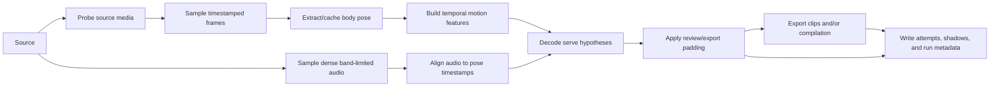

# Serve extraction and cutting

> **Status:** Current · **State:** Maintained · **Work:** None · **As of:** 2026-09-14

This document describes the operational pipeline for finding serve attempts in longer sources and exporting reviewable clips or compilations. It is the counterpart to [serve stage-checkpoint analysis](serve-phase-analysis.md): `cut` finds attempt ranges, while stage-checkpoint analysis works inside one attempt range. Terminology follows the [glossary](glossary.md).

The current implementation is a deterministic, local, audio-visual heuristic. It is useful for personal review, not a claim of general serve recognition.

## Usage

### Detect and cut serves

```sh
mise run cut -- VIDEO --padding SECONDS --output {compilation,clips,both}
```

`--padding` defaults to `1` second and must be finite and non-negative. `--output` defaults to `compilation`. Existing media outputs are not replaced unless `--overwrite` is supplied.

Examples:

```sh
mise run cut -- refs/session.mov --padding 1 --output both
mise run cut -- refs/session.mov --padding 0.5 --output clips --overwrite
```

The command writes paths and progress to the terminal. No detected attempt is exported as the entire source: an empty detection produces `attempts.json` and no media output.

### Lower-level commands

These commands are useful for inspecting or testing individual pipeline steps:

```sh
uv run --locked serve-review doctor
uv run --locked serve-review probe VIDEO
uv run --locked serve-review extract-poses VIDEO [--cache PATH]
uv run --locked serve-review export VIDEO --ranges RANGES_JSON --output {compilation,clips,both}
```

`probe` writes normalized metadata. `extract-poses` creates a reusable sampled pose cache. `export` accepts either a list of `{start_seconds, end_seconds}` objects or a complete source-bound export-plan JSON document; it does not perform detection.

## Inputs and source-media contract

### Supported source media

The intended sources are local MOV or MP4 files, especially iPhone slow-motion recordings. The source must be a readable file containing a valid video stream that `ffprobe` and FFmpeg can decode. The pipeline does not infer frame rate or orientation from the filename. Audio is optional: missing or unusable audio makes the audio evidence unavailable rather than fabricating a transient.

The approved pose artifact is `models/pose_landmarker_heavy.task` by default. Model files are local prerequisites; the pipeline does not download models or access the network. Run `mise run doctor` before a real run.

### Source timestamps and ranges

`ffprobe` supplies the source duration, rational frame rate, time base, rotation, and a SHA-256 fingerprint. Presentation timestamps (PTS), expressed as decimal seconds, are the canonical time base. Frame number divided by nominal FPS is never used for detection, padding, or export decisions.

Ranges are represented as half-open `[start_seconds, end_seconds)` intervals. Detected ranges are unpadded. Padding expands each side symmetrically and clamps to `[0, source_duration]`. Overlapping padded ranges are unioned for compilation/export; adjacent ranges remain separate. Attempt identifiers are assigned after sorting as `serve-001`, `serve-002`, and so on.

### Source preservation

The source is read only and is never modified. Sampling is sequential and bounded-memory. Export always reads the original source, preserves its normal display orientation and dimensions, and uses filter-based re-encoding rather than stream copy, so cuts are not described as lossless or keyframe-exact. Temporary files are placed beside destinations and atomically renamed after successful FFmpeg completion. Partial media is removed after failures or cancellation.

## Pipeline



### Media probing

`media.probe` invokes `ffprobe` with an argument array and normalizes one video stream into `source.json`. It records dimensions, codec, duration, rational frame rate, time base, rotation, and a `sha256:<hex>` source fingerprint. Rotation metadata is normalized to 0/90/180/270 degrees and applied consistently by the frame sampler and exporter.

### Frame sampling

The default pose schedule is 30 Hz from source time 0 through the source duration, independent of nominal FPS (the CLI permits rates through 120 Hz in the lower-level extractor). 120 fps slow motion is useful development footage, not an input requirement: ordinary 30 fps video is supported. Frames are decoded as upright RGB images and retain their canonical PTS. The sampler selects actual decoded frames; it does not invent frames when a requested schedule is denser than the source. If FFmpeg's uniform FPS filter ends one grid point before the source duration, that final filtered sample is omitted rather than duplicating an image.

### Pose extraction and cache reuse

The Heavy Pose Landmarker runs in serialized MediaPipe `VIDEO` mode on the sampled frames. Only the first detected person is used; no-person frames are stored explicitly. The JSONL cache header binds rows to source fingerprint, model identity, pose schema, sampler orientation, and sampling schedule. A matching complete cache is reused without inference; a matching incomplete cache resumes. Corrupt or stale caches are quarantined and re-extracted. Cancellation/failure can leave a resumable partial cache, but never a complete-looking cache.

### Temporal features

`detection.features` translation- and scale-normalizes pose coordinates, then computes source-time wrist/elbow speed, mean body motion, visibility, overhead evidence, rest/motion evidence, proximal elbow/knee geometry, shoulder tilt, and trailing torso displacement. The default centered smoothing window is three samples. Missing joints and no-person frames remain `None`; low-visibility joints are excluded from version-2 geometry rather than interpolated.

### Attempt-range detection

The default detector is the audio-visual decoder in `detection.decoder`, not the legacy pose-only state machine. It classifies a hypothesis through `idle`, `preparation`, `acceleration`, and `follow_through`:

- preparation starts on upper-body/torso activity;
- acceleration requires an elbow-speed surge and overhead geometry;
- follow-through requires a qualified audio transient near the latest overhead acceleration trigger;
- return to rest with the wrist below the shoulder closes a valid candidate.

The candidate begins at preparation entry and ends at the stillness-exit frame. A preparation without acceleration is recorded as `aborted`; an acceleration without qualifying audio, or an incomplete follow-through, is recorded as `shadow`. Dropout hysteresis bridges a small configured number of missing/low-visibility frames. Audio validation uses a band-limited 1--3.5 kHz RMS signal, a source-median-relative threshold (default ratio 5.0), and an absolute floor; it is supporting evidence, not ball/racket tracking.

### Padding and overlap handling

The planner applies the requested padding only after unpadded detection. It retains both ranges on each `Attempt`: `detected_range` for detector output and `effective_range` for review/export. Effective ranges are source-clamped. The export plan is the sorted union of strictly overlapping effective ranges, so compilation has no dead-time between overlapping padded attempts and no duplicated overlap.

### Export

Each requested clip is named `clips/serve-NNN.mov`; the compilation is `serves.mov`. FFmpeg trims video with `trim`/`setpts` and audio, when present, with `atrim`/timestamp reset. The default video path uses VideoToolbox H.264 at a 6 Mbps target; software `libx264` is available to library callers, but hardware failure is not silently converted to another encoder. Compilation concatenation is built from the validated export ranges and is also re-encoded.

## Outputs

### Default output layout

For the source supplied as `VIDEO`, with stem `source`, the default source artifact directory is:

```text
output/source/
  source.json
  attempts.json
  shadows.json
  run.json
  cache/pose-v1.jsonl
  serves.mov                 # compilation or both
  clips/serve-001.mov        # clips or both
```

Output directories are created as needed. JSON is deterministic and written atomically. Output collisions fail before export unless `--overwrite` is explicit.

### Attempt document

`attempts.json` is a versioned, source-bound `AttemptDocument` containing the source fingerprint and duration, padding, detector/planner method version, sorted attempts, and unioned `export_ranges`. Each attempt contains its stable ID, unpadded `detected_range`, padded/clamped `effective_range`, optional confidence, and finite numeric evidence. `shadows.json` is deliberately separate and does not change the attempts schema; it records non-exported `aborted` and `shadow` hypotheses with decoder provenance.

### Clips and compilation

`--output clips` writes one independently playable file per effective attempt. `--output compilation` writes one gap-free file from unioned effective ranges. `--output both` writes both forms. Empty detection writes no media, because a full source fallback would conceal detector failure.

### Run metadata and errors

`run.json` records pipeline/schema and package versions, source fingerprint, mode, padding, cache path and hit status, detector configuration, pipeline-step timings, artifact paths, shadow count, status (`ok`, `empty`, `error`, or `cancelled`), and error step/message when applicable. The compatibility field remains `stage_timings_seconds`. Failures are reported for a pipeline step such as `probe`, `pose`, `audio`, `detect`, `plan`, or `export`; they do not mutate the source and clean up newly created media.

## Configuration and version provenance

The CLI currently exposes padding, output mode, output directory, overwrite, and FFmpeg/ffprobe executable selection. Detector thresholds are versioned Python configuration objects rather than CLI flags. The active defaults are `FeatureConfig`, `DecoderConfig`, and `PlanConfig`; the legacy `RangeConfig` is retained for the injected pose-only/testing path.

The relevant identities are recorded in `run.json`: `cut-v1`, `candidate-ranges-v1+plan-v1`, decoder schema 2, feature schema 2, and sampler orientation version 2. Changing thresholds, feature semantics, cache identity, or export behavior requires a new method/schema identity rather than silently reinterpreting old artifacts.

## Review workflow

1. Run `mise run cut -- VIDEO --padding 1 --output both`.
2. Open `output/<stem>/serves.mov` for source-level review, or inspect the numbered clips individually.
3. Review `attempts.json` against the original source, paying attention to unpadded versus padded ranges.
4. Inspect `shadows.json` for tosses, silent overhead motions, truncated hypotheses, and other suppressed candidates.
5. If stage checkpoints are needed, run `mise run analyze -- VIDEO` after `cut`, then `mise run review-phases -- VIDEO`; for the current native-PTS one-attempt path, use `uv run --locked serve-review analyze-serve VIDEO [--start-seconds S --end-seconds E]` as documented in [serve stage-checkpoint analysis](serve-phase-analysis.md).

A compilation is a review aid, not ground truth. Confirm false positives and misses in the source before changing thresholds.

## Limitations and interpretation

- The detector is tuned for the development footage and rear-tripod viewpoint; it is not a learned or general stroke classifier.
- Body pose is a proxy for serve activity. There is no ball, racket, court, ground-plane, contact, serve-speed, or handedness claim.
- The audio transient is raw-source supporting evidence and may be absent, delayed, masked, or triggered by another sound.
- A visible player is required for most pose evidence; occlusion, multiple people, camera motion, cuts, and unusual viewpoints can produce misses or shadows.
- Source-time boundaries are limited by decoded frame timing and heuristic state transitions. Padding improves context but does not improve localization.
- Long active regions are split by configured duration rules in the legacy detector; the audio-visual decoder intentionally suppresses incomplete hypotheses rather than exporting them.
- A successful export only means FFmpeg produced valid media; it does not establish that every range is a serve.

## Evaluation

### Development annotations

Detection evaluation should use source-time interval annotations split by recording session. Keep private labels under ignored `refs/annotations/` and do not tune and evaluate on the same session. Evaluate one-to-one matching at IoU 0.5, precision, recall, onset/end error, retained-duration ratio, extra seconds per attempt, processing seconds per source minute, and peak memory. Inspect every false positive, false negative, shadow, and boundary failure.

The existing automated tests cover probe parsing, timestamp sampling, cache identity/resume behavior, feature extraction, decoder transitions, planning/merging, and FFmpeg argument construction/export. Generated media fixtures are used where practical; private footage and model artifacts are not required.

### Held-out evaluation

Reserve at least one complete recording session before threshold changes. Run the unchanged command on that session, record the metrics above, and manually inspect the complete output. Do not call cutting reliable from a single successful compilation. The design targets are provisional personal-use goals of roughly 95% recall and 90% precision; they are not current measured guarantees.

## Deferred work

- Stage-checkpoint coherence between attempt detection and checkpoint analysis.
- Uniform-time filtering and further native-FPS processing improvements for long sources containing multiple attempts. Attempt-range decoding already seeks to the range start and reuses source PTS listings within one process.
- Better camera/viewpoint/player tracking and multi-person handling.
- Ball, racket, court, and ground-plane tracking.
- Learned or corpus-trained range detection and broader stroke recognition.

## Code map

### CLI and orchestration

- [`src/serve_review/cli.py`](../../src/serve_review/cli.py): command parsing and user-facing errors.
- [`src/serve_review/pipeline.py`](../../src/serve_review/pipeline.py): `run_cut`, pipeline-step orchestration, atomic artifacts, cancellation, and cleanup.
- [`src/serve_review/domain.py`](../../src/serve_review/domain.py): versioned source/range/attempt/export schemas.

### Media adapters

- [`src/serve_review/media/probe.py`](../../src/serve_review/media/probe.py): ffprobe metadata and fingerprints.
- [`src/serve_review/media/frames.py`](../../src/serve_review/media/frames.py): timestamped RGB sampling and orientation.
- [`src/serve_review/media/audio.py`](../../src/serve_review/media/audio.py): raw-source audio sampling and transient qualification.
- [`src/serve_review/media/export.py`](../../src/serve_review/media/export.py): clip and compilation FFmpeg export.

### Pose and cache

- [`src/serve_review/pose/extract.py`](../../src/serve_review/pose/extract.py): sampled inference coordination.
- [`src/serve_review/pose/mediapipe.py`](../../src/serve_review/pose/mediapipe.py): Heavy Pose Landmarker adapter.
- [`src/serve_review/pose/cache.py`](../../src/serve_review/pose/cache.py): versioned resumable JSONL cache.

### Detection features and ranges

- [`src/serve_review/detection/features.py`](../../src/serve_review/detection/features.py): normalized temporal pose features.
- [`src/serve_review/detection/decoder.py`](../../src/serve_review/detection/decoder.py): audio-visual state decoder and shadows.
- [`src/serve_review/detection/plan.py`](../../src/serve_review/detection/plan.py): padding, stable IDs, and overlap union.
- [`src/serve_review/detection/ranges.py`](../../src/serve_review/detection/ranges.py): legacy hysteresis candidate detector.

### Export

See [`src/serve_review/media/export.py`](../../src/serve_review/media/export.py), especially `export_clips`, `export_compilation`, and `export_outputs`.

### Tests

Detection and media behavior is covered by [`tests/`](../../tests/), including `test_pipeline.py`, `test_decoder.py`, `test_features.py`, `test_detection_ranges.py`, `test_export_clips.py`, `test_export_compilation.py`, `test_probe.py`, and `test_pose_cache.py`.

## Historical material

Historical implementation plans are in [archive/](../archive/). They are context only; current behavior is defined by this document, the code, and the general [design](../architecture/offline-pipeline.md).
