# Serve stage-checkpoint analysis

> **Status:** Current · **State:** Maintained · **Work:** None · **As of:** 2026-09-14

This document describes what `analyze-serve` actually does today. Its filename and several implemented command/type names retain the older “phase” terminology pending the migration recorded in the [glossary](glossary.md). The analyzer estimates point checkpoints for named serve stages; it does not segment continuous biomechanical phases. Historical M4 plans are in [archive/](../archive/).

Throughout this document, **presentation timestamps (PTS)** are the source-video display times used for analysis; **frames per second (FPS)** is only a cadence description, not the canonical time base; **three-dimensional (3D)** refers to MediaPipe world-landmark coordinates; **second-order sections (SOS)** are the numerically stable filter representation; and **root mean square (RMS)** is the audio-energy summary.

## Usage

`analyze-serve` accepts one source containing one attempt, or one explicit source range containing one attempt. It does not require `cut`, `attempts.json`, or legacy sparse pose caches.

```sh
uv run --locked serve-review analyze-serve VIDEO
uv run --locked serve-review analyze-serve VIDEO \
  --start-seconds 2.0 --end-seconds 6.0 \
  --output-dir output/my-review \
  --cache output/my-cache/kinematic-track-v1.jsonl
```

`mise.toml` does not currently expose an `analyze-serve` task; use the `uv run` command above. For a source containing multiple attempts, first use `cut` to make or select one attempt range or clip, then run `analyze-serve` on that range or clip.

Optional `--anchor2comparison` is deliberately narrow: it compares only the fixed local development anchor-2 video with its fixed manual labels. It is not a general annotation interface.

Outputs are written atomically beneath `<output-dir>/<video-stem>/`:

```text
checkpoints.json                 selected checkpoints for eight stages
serve-3d-diagnostics.json        versions, PTS, candidate counts, selected cues
review-serve-3d/index.html       source-frame review page
review-serve-3d/review.json      deterministic review manifest
review-serve-3d/*.jpg            selected frames; manual frames when requested
cache/kinematic-track-v1.jsonl   default reusable native 3D cache
```

A compatible cache avoids native-frame inference. The backend is still initialized to establish model identity, so MediaPipe startup logging does not itself prove a cache miss. `AnalyzeServeResult.cache_hit` and `inferred_frames` are authoritative for programmatic callers.

## Pipeline and data contract

```mermaid
flowchart LR
    source["One source or explicit attempt range"]
    pts["Decode every native frame<br/>preserve exact presentation timestamps (PTS)"]
    pose["MediaPipe Heavy inference<br/>world 3D landmarks + optional 2D overlay landmarks"]
    cache["Source/model-bound reusable<br/>kinematic-track cache"]
    filter["Per-joint, per-axis segment-safe<br/>Butterworth low-pass filter"]
    waves["Timestamped 3D waveform matrix<br/>geometry, relative wrist motion, derivatives, settling"]
    audio["Optional raw-source audio<br/>band-pass RMS + shared transient qualification"]
    candidates["Six dense weighted candidate sets<br/>start, release, loading, cocking, contact, finish"]
    dp["Dynamic-programming chronology search<br/>including contact-to-finish guard"]
    derived["Derive acceleration and deceleration<br/>as selected-anchor midpoints"]
    review["Atomic checkpoints.json<br/>diagnostics JSON + source-frame HTML review"]

    source --> pts --> pose --> cache --> filter --> waves --> candidates --> dp --> derived --> review
    source --> audio --> candidates
    cache -. compatible reuse skips inference .-> filter
```



### Time and coordinates

- Source PTS is canonical. Frame number divided by nominal FPS is never used as checkpoint time.
- Ranges are half-open: `[start_seconds, end_seconds)`.
- Stage-checkpoint geometry uses [MediaPipe Pose Landmarker](https://ai.google.dev/edge/mediapipe/solutions/vision/pose_landmarker) **world landmarks only**. Normalized 2D landmarks from the same inference may be rendered in review overlays but are never waveform values, candidate evidence, or DP inputs.
- In the current world convention, `+y` points down. Upward elevation is therefore `reference_y - joint_y`.
- World landmarks are hip-centered per frame. They cannot measure absolute court height, jump height, or foot contact.

Primary orchestration: [`src/serve_review/analyze_serve.py`](../../src/serve_review/analyze_serve.py), `run_analyze_serve`.

## Cache and filtering

The cache stores native-PTS 3D world observations, missingness, source/model identity, and optional normalized 2D overlay data. Stale/corrupt/incompatible caches are rejected or quarantined rather than silently reused. See [`src/serve_review/pose/world.py`](../../src/serve_review/pose/world.py).

[`world_filter.py`](../../src/serve_review/checkpoints/world_filter.py) applies a [Butterworth filter](https://en.wikipedia.org/wiki/Butterworth_filter) independently to every world `x/y/z` coordinate:

```text
Butterworth low-pass: order 4, cutoff 12 Hz
implementation: [SciPy](https://docs.scipy.org/doc/scipy/reference/signal.html) SOS + zero-phase sosfiltfilt
segment minimum: 21 samples
short interior missing gaps: linear interpolation only
long gaps/missing spans: split; never filtered across
```

The filter estimates sample rate from the median native PTS step and filters by sample index within each qualified segment. It preserves original PTS in output, but does **not** yet uniformly resample irregular PTS before filtering. That improvement is deferred.

### What happens at frame 0

Frame 0 is a real observed source frame, not a fabricated pre-roll frame. It is filtered through SciPy's zero-phase odd-extension boundary handling and is marked as a filter-edge sample with reduced filter confidence.

Waveform derivatives at the first qualified sample use a forward difference:

```text
(p[1] - p[0]) / (t[1] - t[0])
```

Interior samples use a centered nonuniform-PTS difference:

```text
(p[i+1] - p[i-1]) / (t[i+1] - t[i-1])
```

Consequently, an edge motion value can differ materially from a visually similar nearby interior frame, especially because 3D depth motion is included. Channel quality records this boundary condition, but current composite scores use availability rather than quality-weighted cue contributions. This is a known limitation, not a claim that edge derivative evidence is equally reliable.

## Waveforms

[`kinematic_waveforms.py`](../../src/serve_review/checkpoints/kinematic_waveforms.py) defines the exact channel inventory in `CHANNEL_NAMES`, units in `CHANNEL_UNITS`, and construction in `build_kinematic_waveform_track`.

Current channel families are:

| Family | Examples | Units / meaning |
| --- | --- | --- |
| Joint geometry | bilateral knee/elbow flexion and velocities | degrees, degrees/s |
| Trunk geometry | shoulder/hip tilt, transverse shoulder--hip separation, `torso_verticality`, `hip_ankle_vertical_extent` | degrees or body lengths; not global body rise |
| Toss arm | `left_arm_elevation`, `left_arm_extension` | body lengths |
| Dominant wrist position | right wrist relative to shoulder, elbow, torso midpoint, pelvis midpoint (`dx`, upward-positive `dy`, `dz`, distance) | body lengths |
| Dominant wrist motion | speed, acceleration, local speed/acceleration peak and trough flags | body lengths/s, body lengths/s², flags |
| Settling | `whole_body_settling_energy` | mean squared normalized 3D velocity |
| Audio | `audio_transient_energy`, `audio_transient_flag` | band-limited RMS / explicit 0-or-1 flag |

`whole_body_settling_energy` uses bilateral shoulders, elbows, wrists, hips, knees, and ankles. Each joint's filtered world position is normalized by current torso length; its 3D PTS-aware velocity is squared; the channel is the mean of those 12 squared magnitudes. It is a motion proxy, not a visual-stillness or ground-contact detector.

Audio is decoded from the raw source once, band-limited to 1.0--3.5 kHz, RMS sampled on a dense schedule, max-pooled to exact pose PTS, and qualified with the shared M3 policy:

```text
threshold = max(audio_transient_floor, median energy * audio_transient_ratio)
```

A qualified binary flag remains `0`/`1`; it is not quantile-normalized away. See [`media/audio.py`](../../src/serve_review/media/audio.py), `qualify_audio_transients`.

## Six searched stage checkpoints

The DP directly searches checkpoints for `start`, `release`, `loading`, `cocking`, `contact`, and `finish`. `acceleration` and `deceleration` are not independently searched:

```text
acceleration = midpoint(cocking, contact)
deceleration = midpoint(contact, finish)
```

The implementation currently submits a checkpoint candidate at every native waveform sample for every directly searched stage. Candidate scores are weighted means over available cues. Continuous cues are normalized within the attempt using 5th/95th percentiles; missing cues are omitted from the available-weight denominator and reduce coverage. This dense-candidate policy is intentional current behavior, but sparse stage-event eligibility is deferred.

The authoritative cue names, weights, score normalization, and candidate codec are in [`composite_anchors.py`](../../src/serve_review/checkpoints/composite_anchors.py): `COMPOSITE_CUE_NAMES`, `COMPOSITE_DEFAULT_WEIGHTS`, `_extract_raw_cues`, and `build_composite_anchor_set`.

### Latest development cue weights

| Stage | Cues and weights | Operational interpretation |
| --- | --- | --- |
| Start | arm low `.45`; stillness `.35`; arm-elevation rise `.15`; left-elbow extension `.05` | low/still toss setup is favored over the instantaneous rise peak. It is still a dense static score, not yet a low-before-sustained-rise event rule. |
| Release | left-arm elevation `.30`; elevation rise `.30`; extension `.25`; preparation `.15` | toss-arm elevation/rise/extension estimate; no ball tracking claim. |
| Loading | knee flexion `.20`; shoulder--hip separation `.20`; tilt `.15`; left arm `.20`; right-elbow flexion `.15`; stillness `.10` | trophy/loading configuration proxy. |
| Cocking | wrist-elevation trough `.25`; wrist acceleration `.20`; torso verticality `.15`; knee unload `.15`; loading unwind `.25` | pre-contact dominant-arm/loading transition proxy. |
| Contact | wrist-elevation apex `.25`; wrist-speed peak `.20`; wrist-acceleration peak `.15`; torso verticality `.10`; directional arm extension `.10`; audio transient `.20` | body-pose contact estimate with optional qualified raw-audio support. `body_pose_audio` provenance is assigned only for a strictly positive selected audio cue. |
| Finish | right-wrist speed trough `.60`; whole-body settling `.25`; torso-settling proxy `.15` | early follow-through/recovery trough proxy, not eventual standing rest. |

For contact, arm extension contributes only while the right wrist is above the shoulder under the upward-positive convention. Speed and acceleration **peaks** are distinct from troughs; contact does not reward low-motion valleys.

## Chronology and finish bound

[`six_anchor_solver.py`](../../src/serve_review/checkpoints/six_anchor_solver.py) retains the existing DP recurrence, chronology, transition bonus, and skip behavior. The M4 `analyze-serve` configuration adds one development-specific transition guard:

```text
selected_finish - selected_contact <= 0.80 s
```

It applies only to the direct six-anchor `contact -> finish` pair. It does not alter the shared legacy solver's default behavior or other stage transitions. See `transition_feasible`; the M4 configuration is created in `analyze_serve.py` as `phase-solver-serve-default-v2`.

## Version provenance

Current production outputs identify the relevant contracts:

```text
waveforms:  kinematic-waveforms-default-v3 / kinematic-waveforms-v3
composites: composite-anchors-default-v5 / composite-anchors-v4
M4 solver:  phase-solver-serve-default-v2
filter:     world-butterworth-default-v1 / butterworth-sos-zerophase-v1
```

These IDs distinguish current outputs from earlier coordinate, cue, and configuration semantics. Do not compare old candidate scores as though they used current definitions.

## Review and interpretation

`review-serve-3d/index.html` is the primary review page. It renders checkpoint keyframes and, for the narrow anchor-2 comparison mode, manual keyframes and signed selected-minus-manual deltas. `serve-3d-diagnostics.json` records selected cue values, total scores, PTS, candidate counts, and identities.

A high score means that the current waveform heuristic prefers the frame. It is useful alongside source playback, the review page, and diagnostics rather than as an authoritative biomechanical measurement. In particular:

- no ball, racket, foot-contact, court-height, or jump-height claim is made;
- 3D depth/angle estimates can be unreliable even when image appearance looks plausible;
- filter-edge derivative channels have reduced recorded quality that is not yet score-weighted;
- finish is currently bounded after contact but is not yet a robust “first meaningful trough” event;
- all stage-checkpoint candidate sets remain dense.

## Deferred work

The latest configuration deliberately leaves these out of the current production path:

1. uniform-time filtering with evaluation back at exact source PTS;
2. 3D limb-length/depth consistency, angle-quality gating, and propagation of edge/quality metadata into scoring;
3. arbitrary-time diagnostic inspection output;
4. sparse, stage-specific event eligibility, including low-before-rise start and first meaningful post-contact-trough finish rules;
5. configurable native-FPS processing/performance work for longer sources containing multiple attempts. The current one-attempt path already processes every native frame;
6. ball and racket tracking, including explicit toss/release and racket-contact evidence;
7. ground-plane or tennis-court grounding for foot contact, landing, and absolute body-height claims;
8. a formally designed 3D--2D hybrid/observation-quality contract. At present, 2D remains overlay-only and cannot affect filtering, features, candidates, or DP;
9. camera calibration, multi-view processing, and stronger viewpoint/handedness handling; and
10. learned or corpus-trained stage-checkpoint models, including the separately proposed M5 experiment.
