# Serve extraction and cutting

This document will describe the operational pipeline for finding serve attempts in longer source videos and exporting reviewable clips or compilations. It is intended to be the counterpart to [Serve phase analysis](serve-phase-analysis.md).

## Usage

### Detect and cut serves

```sh
mise run cut -- VIDEO --padding SECONDS --output {compilation,clips,both}
```

### Lower-level commands


## Inputs and source-media contract

### Supported source media


### Source timestamps and ranges


### Source preservation


## Pipeline

```mermaid
flowchart LR
    source["Source video"]
    probe["Probe source media"]
    frames["Sample timestamped frames"]
    pose["Extract/cache body pose"]
    features["Build temporal motion features"]
    candidates["Detect serve attempt ranges"]
    padding["Apply review/export padding"]
    export["Export clips and/or compilation"]
    artifacts["Write attempts and output artifacts"]

    source --> probe --> frames --> pose --> features --> candidates --> padding --> export --> artifacts
```



### Media probing


### Frame sampling


### Pose extraction and cache reuse


### Temporal features


### Attempt-range detection


### Padding and overlap handling


### Export


## Outputs

### Default output layout


### Attempt document


### Clips and compilation


### Run metadata and errors


## Configuration and version provenance


## Review workflow


## Limitations and interpretation


## Evaluation

### Development annotations


### Held-out evaluation


## Deferred work

- Phase-informed serve-detection coherence.
- Additional camera viewpoints and player configurations.
- 

## Code map

### CLI and orchestration


### Media adapters


### Pose and cache


### Detection features and ranges


### Export


### Tests


## Historical material

Historical implementation plans are in [archive/](archive/).
